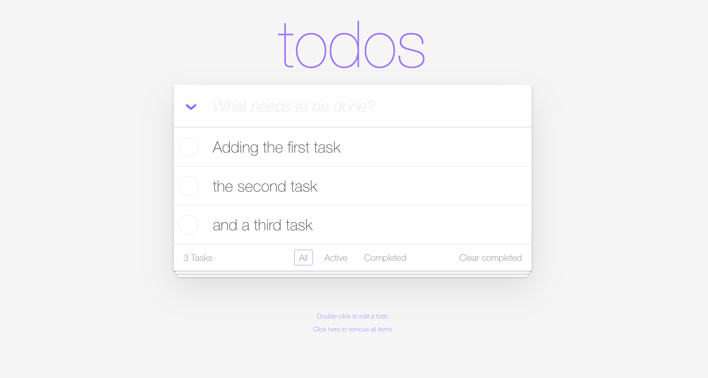
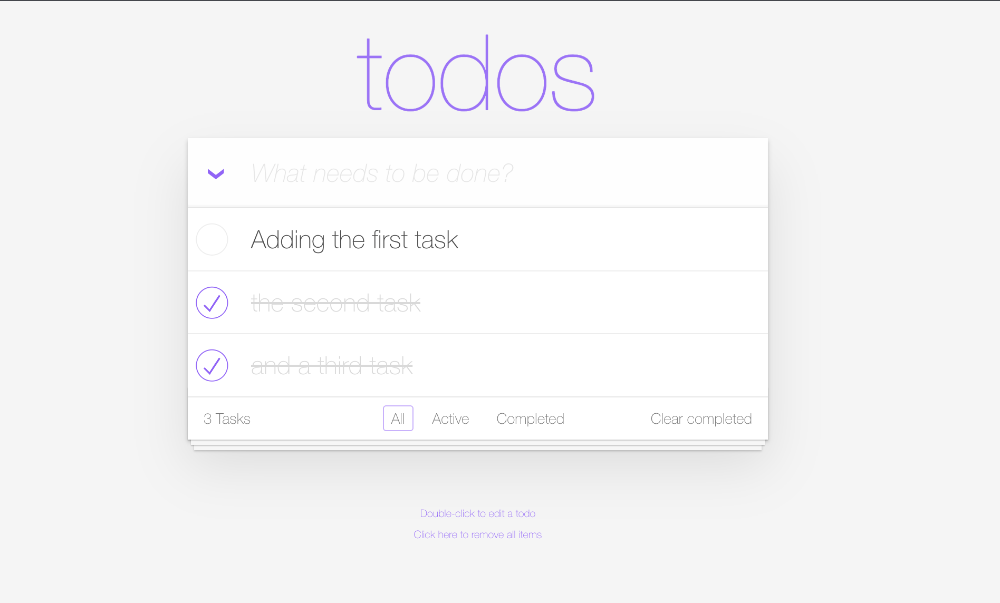

--8<-- "snippets/1-bug-clear-completed.js"

!!! note "The Bug 'Clear completed'"
    Level: Beginner

## Open the TODO App and add a couple of tasks

In VSCode open a new terminal and in the Welcome Message you should see a link to the Todo App UI. Click on it. Now add a couple of tasks.
It should look something like this:

- Add a couple of tasks. 
- Complete some of them (or all, depending how productive you are ;) . 
- Now click on: ``Clear completed`` 

- Are the tasks cleared?

Apparently the button does not work. When clicked - completed todos are not cleared. 

We embark our Bug hunting journey! 

There are multiple ways how dive deep into the issue because Dynatrace is monitoring your Kubernetes cluster, all workloads in it, all it's traces with code level insights and all real users accessing the exposed application.

- [Click Here to continue the quest:octicons-arrow-right-24:](1-bug-hunt-via-k8s.md)

