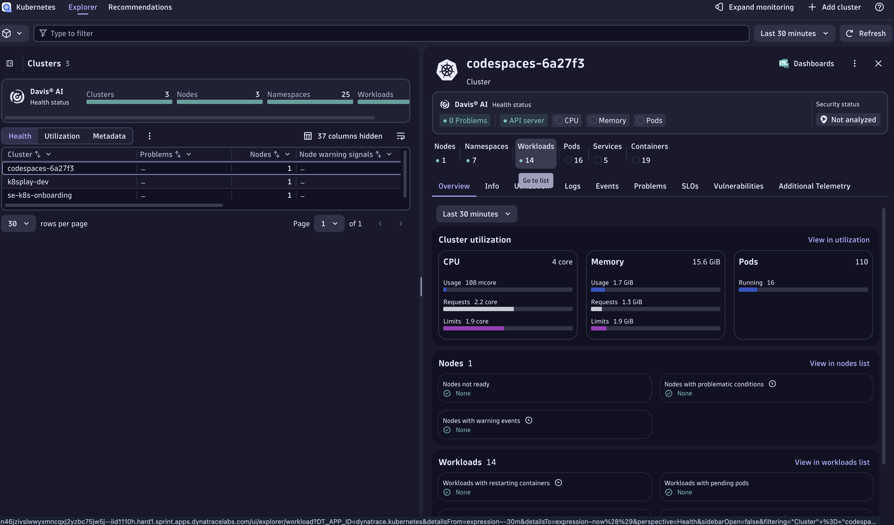
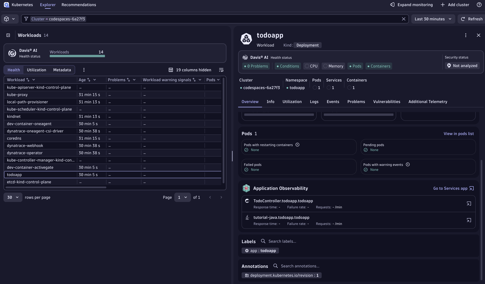
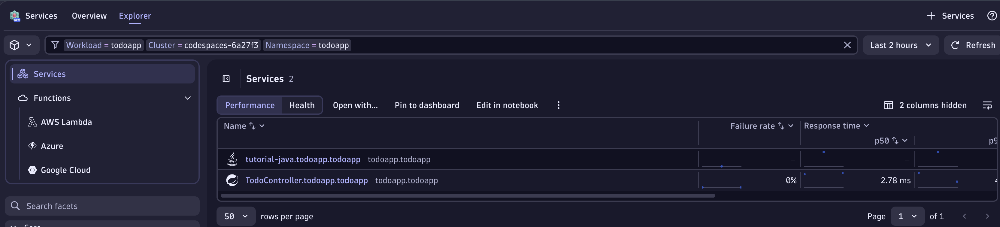
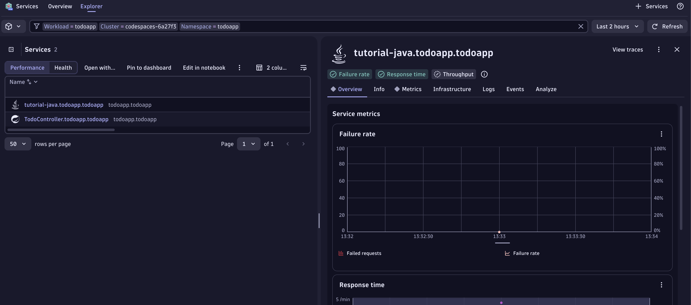
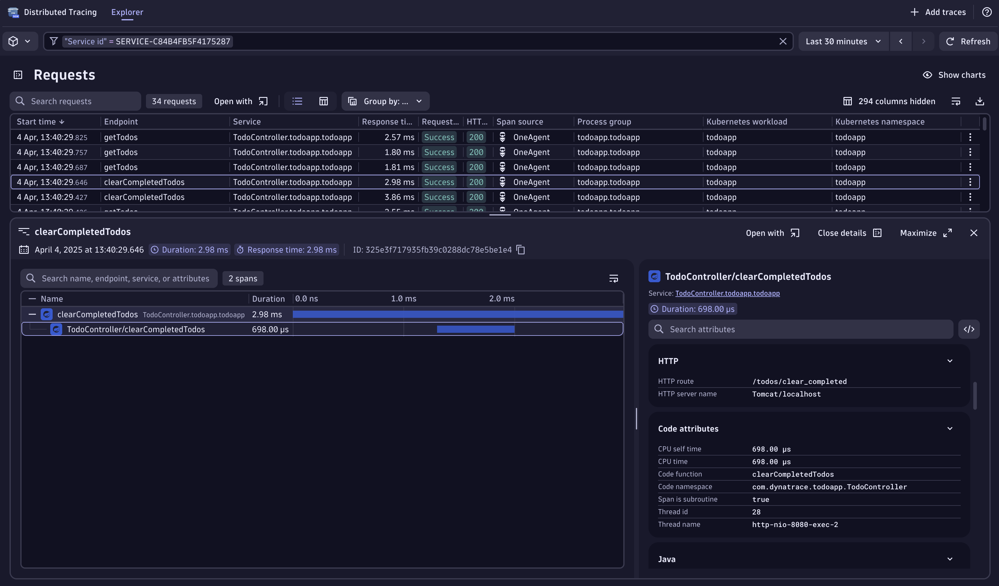
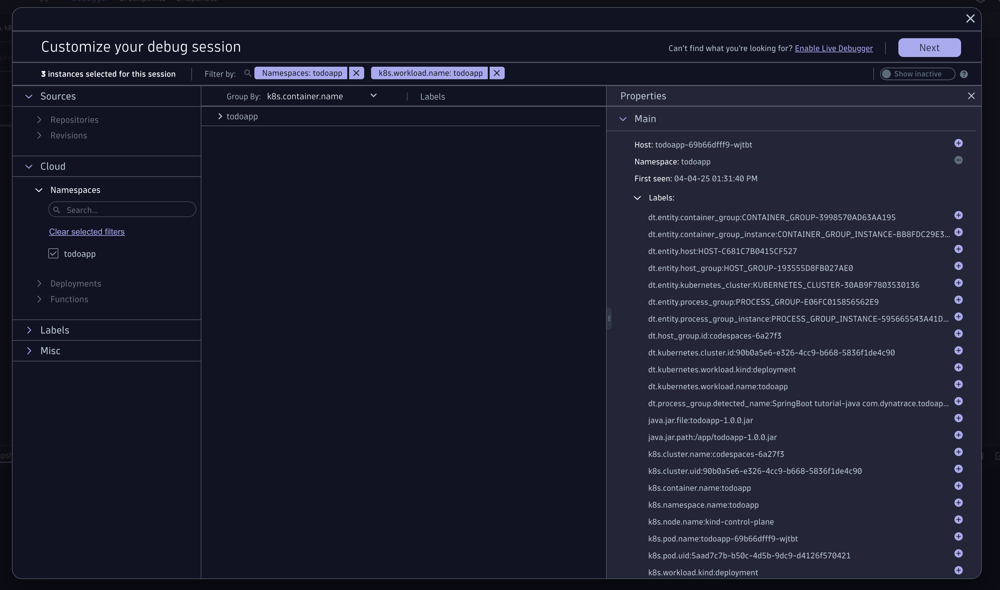
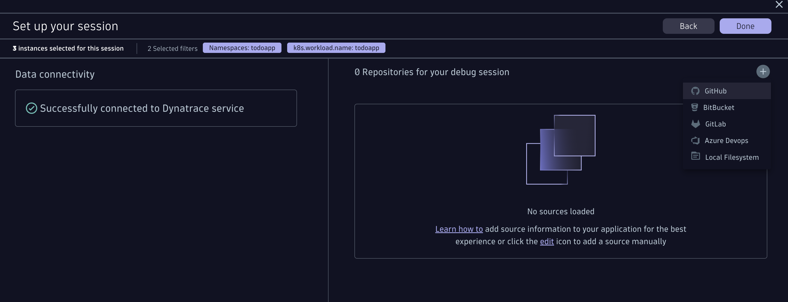
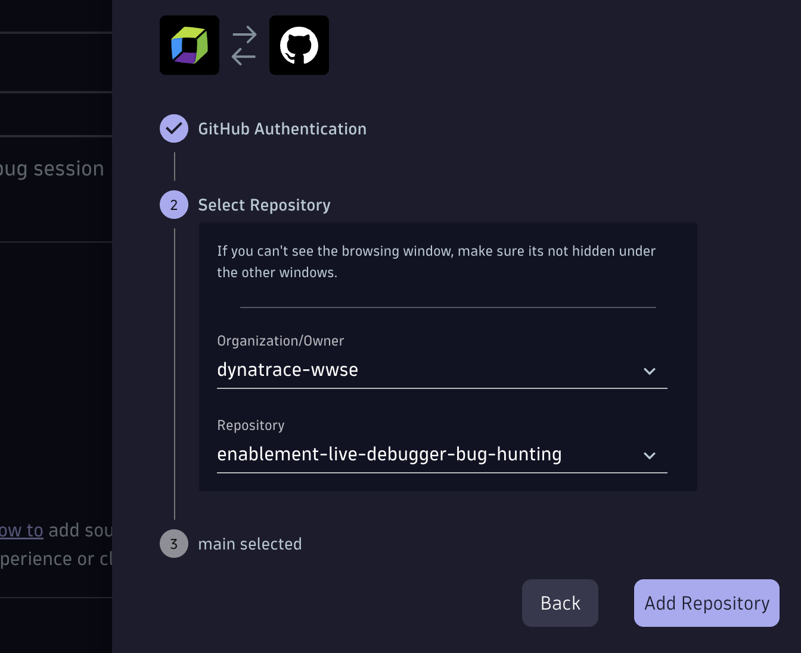
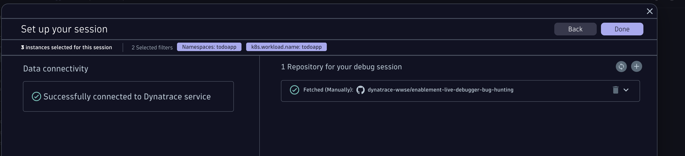
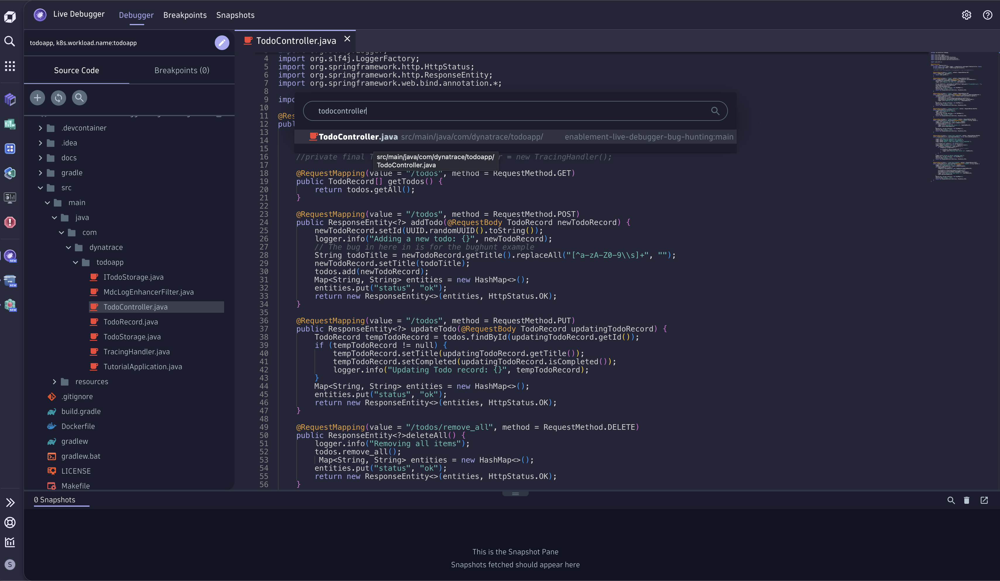

--8<-- "snippets/1-bug-hunt-via-k8s.js"

## Hunting via the kubernetes road

- Open the Kubernetes App > You'll see a cluster with the name "codespace-xxxx". That's your Kind cluster being FullStack monitored.

- On the right hand side, click on Workloads, the Workloads Page will open. 

- Select the `todoapp`workload. 

- On the Overview in the right hand side, scroll down and open the Services app. (this are the traces grouped withing Dynatrace Services)

- Click on the Spring Boot one and then on the right corner "View Traces"

- This will open all the traces that went through your application... wow!

As you can see, there are traces with the name `clearCompletedTodos` that just took a couple ms and are not throwing any errors. The response code is 200, but since this is a bug it does not mean the application is working as expected.

This specific span it was just 2.98ms. On the right hand side, you can see the Tracing details, look how much data was captured automatically 🤩.

In the second node of the span, in the **Code Attributes** section, we can see the ``Code function: clearCompletedTodos`` and the ``Code Namespace: com.dynatrace.todoapp.TodoController`` 

Now we know which method and which package! Let's put our Developer Hat 🎩 and open the Live Debugger.

## Open Live Debugger

Type CTRL + K > Live Debugger for super fast access to the Live Debugger application. 

In "Customize your debug session" we add the filters ``namespace:todoapp`` ``k8s.workload.name:todoapp``. This information was also available in the trace that we just took a look at. There are multiple filters you can add, important here is to have a filter that can be reused and is not specifc to an instance in case the pods a recycled and you want to make sure you are always setting breakpoints to a specific workload in a specific cluster (or multiple)

## Connect the Github repository (manually)

Once you click next, no repository was found for this application (this is because no repo was configured). Let's add it manually.

- Click on the + sign to add a new one

- Click on authenticate. It'll open a window where you'll authenticate with your GitHub personal account.

Why? we take security very seriously, meaning the source code will never leave the browser, the client. 

- In organisation you enter: ``dynatrace-wwse``
- In Repository you enter this repo: ``enablement-live-debugger-bug-hunting``

- Click on Done!

Now you are all set! you should see an  image like this:

## Navigate to the TodoController.java

You have multiple ways to open the TodoController.java. Let's say you know the code, then easily you'll navigate to it by opening the Source Code menu on the left pane, navigate to: ``todoapp > src > main > java > com > dynatrace > todoapp > TodoController.java``

if you don't know the structure, use the search and type ``TodoController``it'll search for all matches, you'll see the Class file so you can open it.

Now let's search for the Method ``clearCompletedTodos``. You'll find it around line 72.
Set up a non-breaking-breakpoint on the return code.

Go back to the TODO app and clear again on "Clear completed"

Return to the Live Debugger and see the Snaphot captured, open it and see all the variables that were captured with their values.

Do you see the bug? can you understand what happened and why the completed todos are not deleted? We can see two variables, the ``todos`` with a length of 3 and ``todoStore`` with a length of 0.

In line 84 ``todoStore.remove(todoRecord)`` the variable todoStore is a newly instantiated variable. This is a mistake, it should be replaced by the variable ``todos`` so the function can succesfully remove all cleared tasks!

Yay! we found the first bug!!!

!!! tip "Seeing is believing 🤩"
    Did you notice? With Dynatrace we were able to navigate from the Kubernetes Cluster all the way down to the workload, it's traces cotinuing down to the specific method and namespace of the called function and variables. With one click on the method we were able to set a **non-breaking** breakpoint in our production application deployed in a Kubernetes Cluster where with a single snapshot we were able to identify the bug. Debugging Kubernetes Clusters has never been so easy!!! And in Production!! 🤯

- [Click here to continue the quest with the next Bug:octicons-arrow-right-24:](2-bug-special-characters.md)

