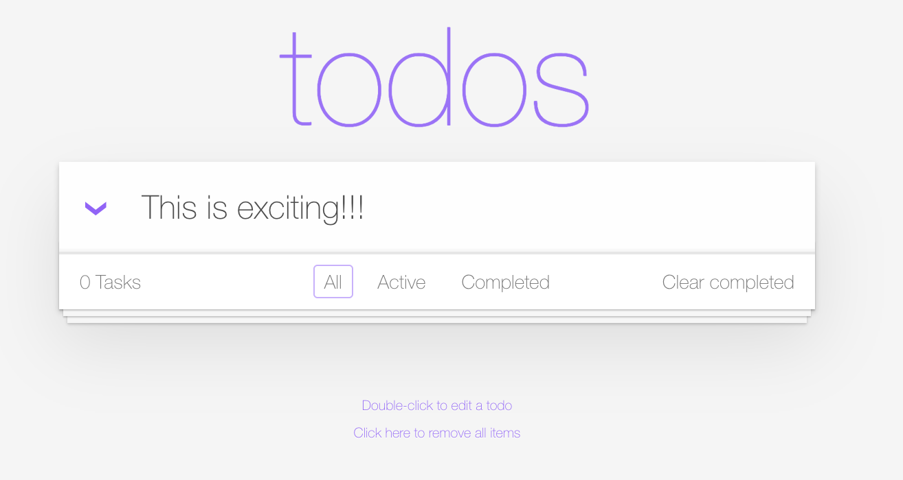
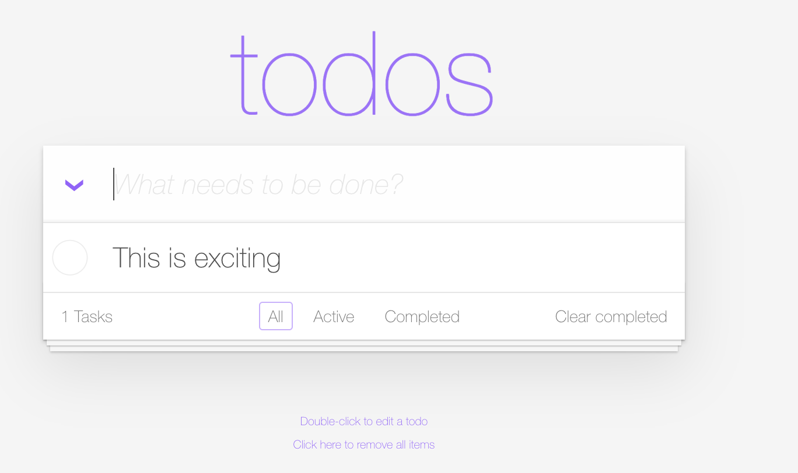

--8<-- "snippets/2-bug-special-characters.js"

!!! note "The Bug 'Special characters'"
    Level: Beginner

## Open the TODO App and add a Task with an exclamation mark!

- Add a task with an exclamation mark! or a special character for that matter, like this:

- Now type ENTER to add the task

- What happened? As you can see the signs are being removed. Why?

Let's continue with the bug hunting again! Now, let's assume we are new developers in the TODO app company. How difficult would it be to find the bug? To know where is the app running? which pod is delivering the requests? which namespace and line of code? Well, not with Dynatrace! We already learned how easy it was to find the TODO app within the Kubernetes App and from there we opened the traces in the Distributed Tracing app, so let's go there.

- [Click here to Continue the quest:octicons-arrow-right-24:](2-bug-hunt-via-tracing.md)

