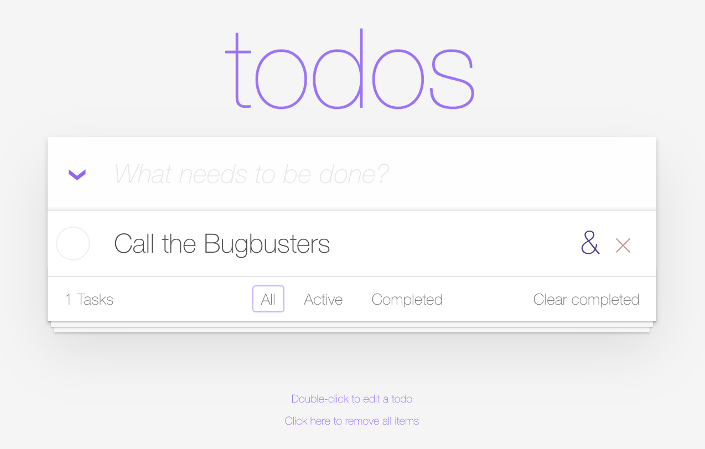
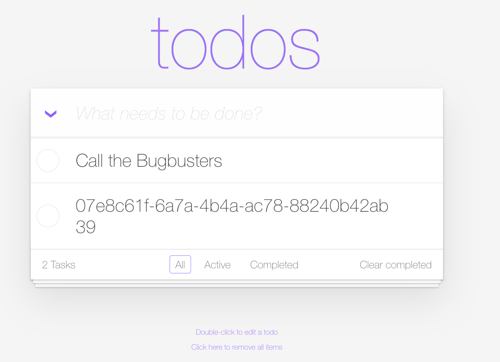

--8<-- "snippets/3-bug-duplicate-task.js"

!!! note "The Bug 'Duplicate task'"
    Level: Intermediate

## Open the TODO App and add a Task

The TODO app has a duplicate function, let's give it a try.

- Add a Task that we want to duplicate, we add **Call the Bugbusters**

- Hover over the added Task and on the right you'll notice a **&** symbol. This should duplicate the task.

What happened? 
We notice a new task was created, but instead of a duplicate we see a weird string, looks like an ID. 

Let's continue our Bug Hunting Quest!

- [Click here to continue the quest:octicons-arrow-right-24:](3-bug-hunt-via-logs.md)

