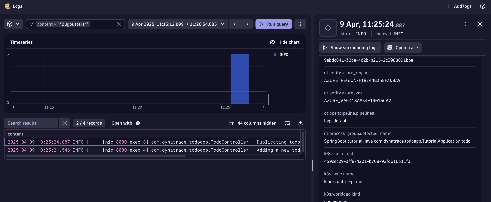
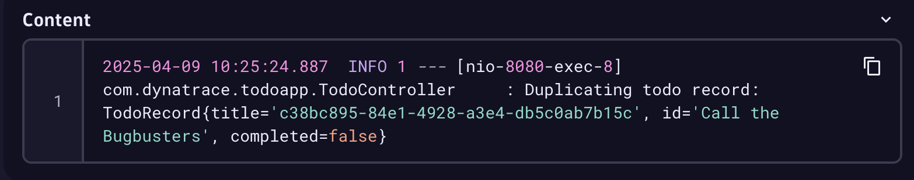
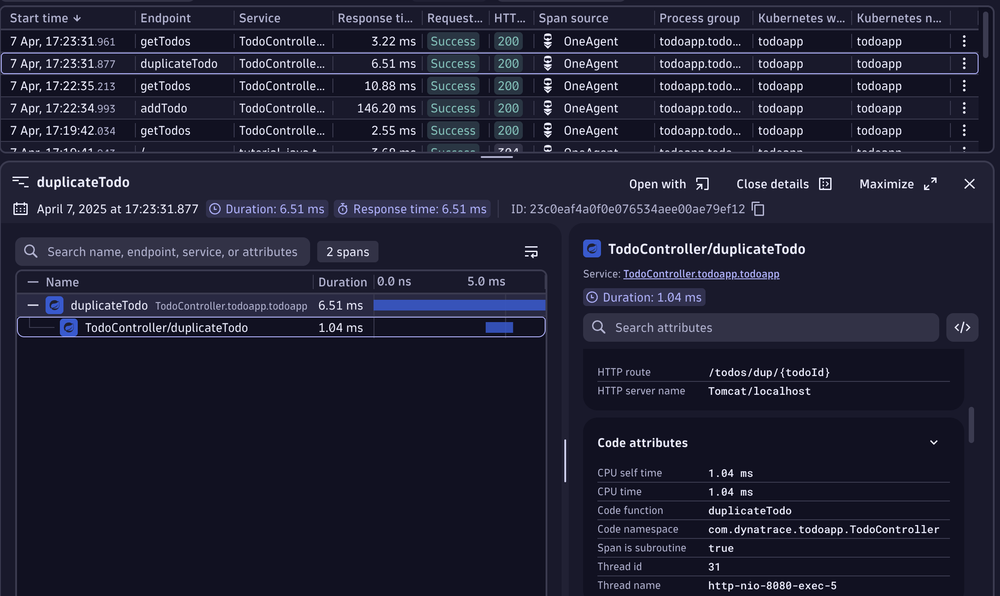
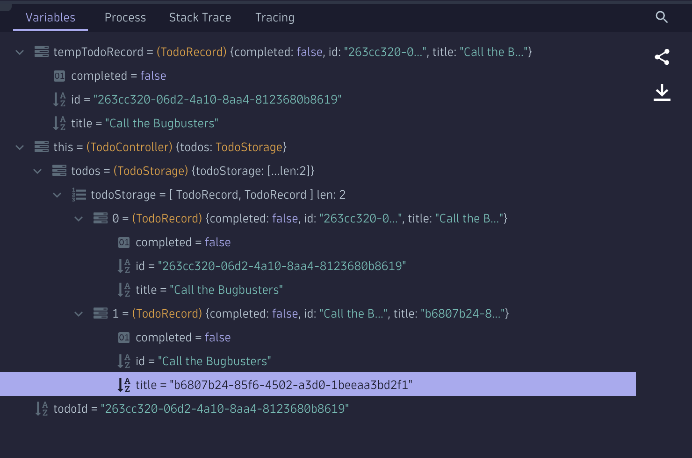
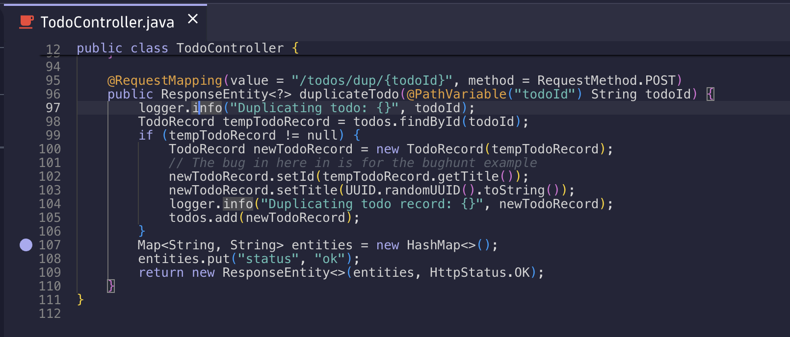

--8<-- "snippets/3-bug-hunt-via-logs.js"

## Hunting road - Logs App
Now let's try a different approach, we have seen how easy it is to find the traces via the Distributed Tracing App. Let's find the trace and it's method and codespace via the Logs App. The Dynatrace Plattform is context aware, it knows which traces write which logs, from which pod they are coming from and even which user generated the transaction. 

- Open the Logs App. Again let's be a pro and type CTRL + K and then Logs, the Logs App should appear in the super search.
- In the filter type the content or part of the content of the Task, in my case I wrote `Call the Bugbusters`, so I'm searching for `content=*bugbusters*`. I'm assuming the developers is logging the content I'm writing in the app since "we don't know the code" and in our quests we are searching via logs. Let's see if we are lucky.

Wow, that was fast, we see two log entries with that match and are coming from the same pod. One was adding the task, the other duplicating it. 

- We can either right click on the Log line and **open record with** and you select the **Distributed Tracing** app or on the right pane, above the Topology of the Log entry, there is a button for your convenience that says **Open trace**

- Either way will open the Distributed Tracing app

From the content if you look carefully, you can see that the duplicate has the ID and title swapped.

## Hunting road - Distributed Tracing App 

!!! Note "Via the Distributed Tracing app"
    In case you want to skip searching the Trace via the log entries, here is how to find it only via traces:

    - In the filter add `"Kubernetes namespace" = todoapp AND "Kubernetes workload" = todoapp`
    
    - See the incoming requests, you'll notice one with the name `duplicateTodo`

- The trace has the `Code function = duplicateTodo` and the `Code Namespace = com.dynatrace.todoapp.TodoController`

- Now that we have the trace, weather we found it via the Log entries or the traces, we can notice that it has also a HTTP Code 200, meaning there are no failures, but the app does not work as we want it to work. Let's debug the function!

## Open the Live Debugger

- Let's search for the `Code function = duplicateTodo` under the `Code Namespace = com.dynatrace.todoapp.TodoController`, in the search by typping `TodoController` the class file appears, open it.
- The declaration the of the `Code function = duplicateTodo` is in line 95.
- Let's put a non-breaking breakpoint on line 107
- Go to the Todo app and repeat the bug.

Did you notice how the Map has in the items [0] and [1] the title and UUIDs are swapped?

- This is also noticeable in the sourcecode, lines 102 and 103 are being swapped. 

- [Click here to continue :octicons-arrow-right-24:](cleanup.md)

